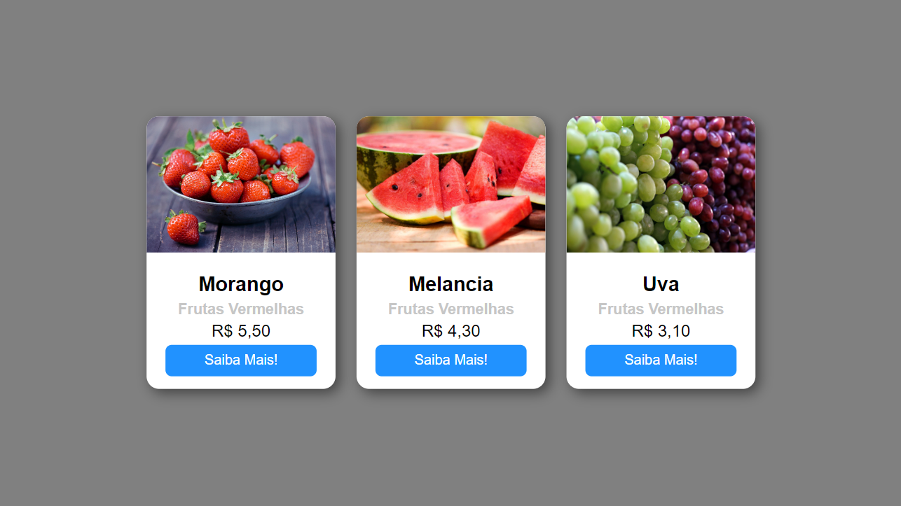

# Meus projetos usando HTML, CSS e JavaScript

## 1. Projeto Portfólio
Este marcou o início do meu primeiro projeto

Portfólio: https://karleandrosilva.github.io/MeusProjetos/portfolio/index1.html

## 2. Projeto Card
Este foi o meu segundo projeto, no qual desenvolvi cartões de frutas que incluíam imagem, nome e preço, seguindo as orientações do vídeo do canal Tricotando no YouTube.

Visualise: https://karleandrosilva.github.io/MeusProjetos/CARD

  

* [Repositório com o código](https://github.com/karleandrosilva/MeusProjetos/tree/main/CARD)
* [Link do Tutorial](https://youtu.be/jNQFOIYeGxg?si=aAaw2P9nhH1j3SSH)
* [Repositório do Tricotando](https://github.com/tricodando/card-html-css)

## 3. Projeto Login Netflix
Este foi meu terceiro projeto

Página Login Netflix: https://karleandrosilva.github.io/MeusProjetos/pagina_login_netflix

## 4. Projeto Tela Login Dark
Este foi meu quarto projeto

Tela Login: https://karleandrosilva.github.io/MeusProjetos/tela_login_dark
* [Link do Tutorial](https://youtu.be/69-WfrVBli8?si=r_KQtNxIulefKJkR)

## 5. Projeto Card Carrossel de Natal
Este foi meu quinto projeto

Visualise: https://karleandrosilva.github.io/MeusProjetos/carrossel

## 6. Projeto Tela Login light

Tela Login Theme light: https://karleandrosilva.github.io/MeusProjetos/tela_login_light
